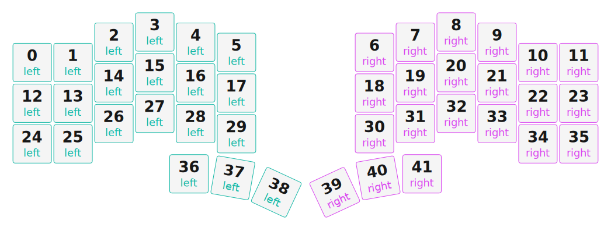

# ZMK Configuration for BCP-SHELL-V3

*Generated by Shield Wizard for ZMK*



Download compiled firmware from the Actions tab. <https://zmk.dev/docs/user-setup#installing-the-firmware>

Edit your keymap <https://zmk.dev/docs/keymaps>.
User keymap is located at [`config/bcp_shell_v3.keymap`](config/bcp_shell_v3.keymap).

-----

<details>
<summary>
Shield Wizard Debug Information
</summary>

In case of broken configuration, here is the Shield Wizard internal data used to generate this configuration:

Commit: 5840d41ac0915092c8fe45da617ffb4bb91e1b97

```json
{"name":"BCP-SHELL-V3","shield":"bcp_shell_v3","dongle":false,"modules":[],"layout":[{"id":"01KRV9MHSPC01532D303G97TFS","part":1,"row":0,"col":0,"w":1,"h":1,"x":0,"y":0.75,"r":0,"rx":0,"ry":0},{"id":"01KRV9MHSP9PGDYWTQMA1XGZSM","part":1,"row":0,"col":1,"w":1,"h":1,"x":1,"y":0.75,"r":0,"rx":0,"ry":0},{"id":"01KRV9MHSP5MH54PFQXRM0TT8G","part":1,"row":0,"col":2,"w":1,"h":1,"x":2,"y":0.25,"r":0,"rx":0,"ry":0},{"id":"01KRV9MHSPJWDQSDJGHEV3YPDT","part":1,"row":0,"col":3,"w":1,"h":1,"x":3,"y":0,"r":0,"rx":0,"ry":0},{"id":"01KRV9MHSPDZSK3DR895VXDYJP","part":1,"row":0,"col":4,"w":1,"h":1,"x":4,"y":0.25,"r":0,"rx":0,"ry":0},{"id":"01KRV9MHSPTS5XZMCZR9M6XM34","part":1,"row":0,"col":5,"w":1,"h":1,"x":5,"y":0.5,"r":0,"rx":0,"ry":0},{"id":"01KRV9MHSPK9Z95Q31NHPHV7FX","part":2,"row":0,"col":6,"w":1,"h":1,"x":8.376,"y":0.5,"r":0,"rx":0,"ry":0},{"id":"01KRV9MHSQQEWXCRY2NWXXHM3X","part":2,"row":0,"col":7,"w":1,"h":1,"x":9.376,"y":0.25,"r":0,"rx":0,"ry":0},{"id":"01KRV9MHSQ8SZ44SX9SV7C5HS5","part":2,"row":0,"col":8,"w":1,"h":1,"x":10.376,"y":0,"r":0,"rx":0,"ry":0},{"id":"01KRV9MHSQNRHVFPG4F85637H8","part":2,"row":0,"col":9,"w":1,"h":1,"x":11.376,"y":0.25,"r":0,"rx":0,"ry":0},{"id":"01KRV9MHSQFQDTCX5613G3383P","part":2,"row":0,"col":10,"w":1,"h":1,"x":12.376,"y":0.75,"r":0,"rx":0,"ry":0},{"id":"01KRV9MHSQNZYKQ0R7SN43J1BZ","part":2,"row":0,"col":11,"w":1,"h":1,"x":13.376,"y":0.75,"r":0,"rx":0,"ry":0},{"id":"01KRV9MHSQXNQGGRXX3KE5KF5S","part":1,"row":1,"col":0,"w":1,"h":1,"x":0,"y":1.75,"r":0,"rx":0,"ry":0},{"id":"01KRV9MHSQ6JYGA0HGZ88T4488","part":1,"row":1,"col":1,"w":1,"h":1,"x":1,"y":1.75,"r":0,"rx":0,"ry":0},{"id":"01KRV9MHSQZERDCRNZ69HHTSA6","part":1,"row":1,"col":2,"w":1,"h":1,"x":2,"y":1.25,"r":0,"rx":0,"ry":0},{"id":"01KRV9MHSQ8R8Z9C3J1M5E49GD","part":1,"row":1,"col":3,"w":1,"h":1,"x":3,"y":1,"r":0,"rx":0,"ry":0},{"id":"01KRV9MHSQCTRD43C7RTHKVFEG","part":1,"row":1,"col":4,"w":1,"h":1,"x":4,"y":1.25,"r":0,"rx":0,"ry":0},{"id":"01KRV9MHSQC0CAM29G6HEVF19S","part":1,"row":1,"col":5,"w":1,"h":1,"x":5,"y":1.5,"r":0,"rx":0,"ry":0},{"id":"01KRV9MHSQN6EXZ2K3S55DAHBK","part":2,"row":1,"col":6,"w":1,"h":1,"x":8.376,"y":1.5,"r":0,"rx":0,"ry":0},{"id":"01KRV9MHSQ87A24DFGP8ZPKJT9","part":2,"row":1,"col":7,"w":1,"h":1,"x":9.376,"y":1.25,"r":0,"rx":0,"ry":0},{"id":"01KRV9MHSQEEWMR37FYC7Y1SS0","part":2,"row":1,"col":8,"w":1,"h":1,"x":10.376,"y":1,"r":0,"rx":0,"ry":0},{"id":"01KRV9MHSQ8M3B4GHM55AWPP53","part":2,"row":1,"col":9,"w":1,"h":1,"x":11.376,"y":1.25,"r":0,"rx":0,"ry":0},{"id":"01KRV9MHSQJ3KCGK8Z56TXCYVC","part":2,"row":1,"col":10,"w":1,"h":1,"x":12.376,"y":1.75,"r":0,"rx":0,"ry":0},{"id":"01KRV9MHSQEQ58VZ55XXGDQQ3J","part":2,"row":1,"col":11,"w":1,"h":1,"x":13.376,"y":1.75,"r":0,"rx":0,"ry":0},{"id":"01KRV9MHSQY17A6YFTEA2ZDXVC","part":1,"row":2,"col":0,"w":1,"h":1,"x":0,"y":2.75,"r":0,"rx":0,"ry":0},{"id":"01KRV9MHSQ4F3PQNWV1M28FBXZ","part":1,"row":2,"col":1,"w":1,"h":1,"x":1,"y":2.75,"r":0,"rx":0,"ry":0},{"id":"01KRV9MHSQ0SRWAFAZ74SPFB14","part":1,"row":2,"col":2,"w":1,"h":1,"x":2,"y":2.25,"r":0,"rx":0,"ry":0},{"id":"01KRV9MHSQJ34ANADQ3XXEDV7E","part":1,"row":2,"col":3,"w":1,"h":1,"x":3,"y":2,"r":0,"rx":0,"ry":0},{"id":"01KRV9MHSQX8E01S63CWZ3GRJ0","part":1,"row":2,"col":4,"w":1,"h":1,"x":4,"y":2.25,"r":0,"rx":0,"ry":0},{"id":"01KRV9MHSQ2R27YJGZY2TEHD92","part":1,"row":2,"col":5,"w":1,"h":1,"x":5,"y":2.5,"r":0,"rx":0,"ry":0},{"id":"01KRV9MHSQNA7FVQFX67742489","part":2,"row":2,"col":6,"w":1,"h":1,"x":8.376,"y":2.5,"r":0,"rx":0,"ry":0},{"id":"01KRV9MHSQ1ZZAF5W10HY4H3GM","part":2,"row":2,"col":7,"w":1,"h":1,"x":9.376,"y":2.25,"r":0,"rx":0,"ry":0},{"id":"01KRV9MHSQVNGTMBKQC9WWGFMQ","part":2,"row":2,"col":8,"w":1,"h":1,"x":10.376,"y":2,"r":0,"rx":0,"ry":0},{"id":"01KRV9MHSQHM02V0YV2PHZV79R","part":2,"row":2,"col":9,"w":1,"h":1,"x":11.376,"y":2.25,"r":0,"rx":0,"ry":0},{"id":"01KRV9MHSQTB4STQM4VC2BDZAV","part":2,"row":2,"col":10,"w":1,"h":1,"x":12.376,"y":2.75,"r":0,"rx":0,"ry":0},{"id":"01KRV9MHSQQ5H0RK8Y9WRRS5E9","part":2,"row":2,"col":11,"w":1,"h":1,"x":13.376,"y":2.75,"r":0,"rx":0,"ry":0},{"id":"01KRV9MHSQ16QWJZ5572HWVW5H","part":1,"row":3,"col":3,"w":1,"h":1,"x":3.836,"y":3.485,"r":0,"rx":0,"ry":0},{"id":"01KRV9MHSQVQFTNYS05DWGZZMN","part":1,"row":3,"col":4,"w":1,"h":1,"x":4.91,"y":3.584,"r":10,"rx":5.41,"ry":4.084},{"id":"01KRV9MHSQ1QNAG668HCP6DRV0","part":1,"row":3,"col":5,"w":1,"h":1,"x":5.974,"y":3.939,"r":25,"rx":6.474,"ry":4.439},{"id":"01KRV9MHSQC8D66HQWNFV8MQY6","part":2,"row":3,"col":6,"w":1,"h":1,"x":7.403,"y":3.939,"r":-25,"rx":7.903,"ry":4.439},{"id":"01KRV9MHSQPA2FB9TM5957FY8X","part":2,"row":3,"col":7,"w":1,"h":1,"x":8.466,"y":3.584,"r":-10,"rx":8.966,"ry":4.084},{"id":"01KRV9MHSQD29EQ3FAG8TA219T","part":2,"row":3,"col":8,"w":1,"h":1,"x":9.54,"y":3.485,"r":0,"rx":0,"ry":0}],"parts":[{"name":"dongle","controller":"nice_nano_v2","wiring":"matrix_diode","pins":{"d2":"bus","d3":"bus","d1":"bus"},"keys":{},"encoders":[],"buses":[{"name":"spi0","devices":[],"type":"spi"},{"name":"spi1","devices":[{"type":"niceview","cs":"d1"}],"type":"spi","mosi":"d2","sck":"d3"},{"name":"spi2","devices":[],"type":"spi"},{"name":"spi3","devices":[],"type":"spi"},{"name":"i2c0","devices":[],"type":"i2c"},{"name":"i2c1","devices":[],"type":"i2c"}]},{"name":"left","controller":"xiao_ble","wiring":"matrix_diode","pins":{"d1":"output","d2":"output","d3":"output","d4":"output","d5":"output","d6":"output","d10":"input","d9":"input","d8":"input","d7":"input"},"keys":{"01KRV96SSEP15J02D1W8M6EZBN":{"input":"d10","output":"d1"},"01KRV96SSE7RENEQ0XWK69V7SR":{"input":"d9","output":"d1"},"01KRV96SSEBDM4CMPRHT0DBX5T":{"input":"d8","output":"d1"},"01KRV96SSE76C36EA7KKXN8YMZ":{"input":"d10","output":"d2"},"01KRV96SSETM8G5M8V5JYVTHF4":{"input":"d9","output":"d2"},"01KRV96SSE35P1S9WDRBQBNHT4":{"input":"d8","output":"d2"},"01KRV96SSEEPQQVXBP5Z1CRRA2":{"input":"d10","output":"d3"},"01KRV96SSE3FRN6HGP61R46JE2":{"input":"d9","output":"d3"},"01KRV96SSE11DPVVEKN07S8QPM":{"input":"d8","output":"d3"},"01KRV96SSE6T24JD5RKV1N7A2W":{"input":"d10","output":"d4"},"01KRV96SSEF76G319QP10YQ3YQ":{"input":"d9","output":"d4"},"01KRV96SSEXZTZ3B005CHD0XP5":{"input":"d8","output":"d4"},"01KRV96SSEX7CMGA0ESJ1VNNGG":{"input":"d7","output":"d4"},"01KRV96SSEJ4R8RTBFGEZ1SYMA":{"input":"d10","output":"d5"},"01KRV96SSE2PJTTKZK3CNYS0HQ":{"input":"d9","output":"d5"},"01KRV96SSEGAF33H7X9R42RJG6":{"input":"d8","output":"d5"},"01KRV96SSF1J7TKDMY7DT5R6RG":{"input":"d7","output":"d5"},"01KRV96SSEPA7517V2W9VDDJX4":{"input":"d10","output":"d6"},"01KRV96SSEG4DQK0153V9BG4CB":{"input":"d9","output":"d6"},"01KRV96SSF5BY760MXHT4JTSD2":{"input":"d7","output":"d6"},"01KRV96SSE72W0ZN4RB9NKZ65R":{"input":"d8"},"01KRV9MHSPC01532D303G97TFS":{"input":"d10","output":"d1"},"01KRV9MHSQXNQGGRXX3KE5KF5S":{"input":"d9","output":"d1"},"01KRV9MHSQY17A6YFTEA2ZDXVC":{"input":"d8","output":"d1"},"01KRV9MHSP9PGDYWTQMA1XGZSM":{"input":"d10","output":"d2"},"01KRV9MHSQ6JYGA0HGZ88T4488":{"input":"d9","output":"d2"},"01KRV9MHSQ4F3PQNWV1M28FBXZ":{"input":"d8","output":"d2"},"01KRV9MHSP5MH54PFQXRM0TT8G":{"input":"d10","output":"d3"},"01KRV9MHSQZERDCRNZ69HHTSA6":{"input":"d9","output":"d3"},"01KRV9MHSQ0SRWAFAZ74SPFB14":{"input":"d8","output":"d3"},"01KRV9MHSPJWDQSDJGHEV3YPDT":{"input":"d10","output":"d4"},"01KRV9MHSQ8R8Z9C3J1M5E49GD":{"input":"d9","output":"d4"},"01KRV9MHSQJ34ANADQ3XXEDV7E":{"input":"d8","output":"d4"},"01KRV9MHSQ16QWJZ5572HWVW5H":{"input":"d7","output":"d4"},"01KRV9MHSPDZSK3DR895VXDYJP":{"input":"d10","output":"d5"},"01KRV9MHSQCTRD43C7RTHKVFEG":{"input":"d9","output":"d5"},"01KRV9MHSQX8E01S63CWZ3GRJ0":{"input":"d8","output":"d5"},"01KRV9MHSQVQFTNYS05DWGZZMN":{"input":"d7","output":"d5"},"01KRV9MHSPTS5XZMCZR9M6XM34":{"input":"d10","output":"d6"},"01KRV9MHSQC0CAM29G6HEVF19S":{"input":"d9","output":"d6"},"01KRV9MHSQ2R27YJGZY2TEHD92":{"input":"d8","output":"d6"},"01KRV9MHSQ1QNAG668HCP6DRV0":{"input":"d7","output":"d6"}},"encoders":[],"buses":[{"name":"spi0","devices":[],"type":"spi"},{"name":"spi1","devices":[],"type":"spi"},{"name":"spi2","devices":[],"type":"spi"},{"name":"spi3","devices":[],"type":"spi"},{"name":"i2c0","devices":[],"type":"i2c"},{"name":"i2c1","devices":[],"type":"i2c"}]},{"name":"right","controller":"xiao_ble","wiring":"matrix_diode","pins":{"d1":"output","d2":"output","d3":"output","d4":"output","d5":"output","d6":"output","d10":"input","d9":"input","d8":"input","d7":"input"},"keys":{"01KRV96SSE189CSKH6535QX6JT":{"input":"d10","output":"d1"},"01KRV96SSE9TF88Q6ZD4KZBZJV":{"input":"d9","output":"d1"},"01KRV96SSE64TVVBFJEFNBQTZ1":{"input":"d8","output":"d1"},"01KRV96SSEMQG7Y8QZQ5HMJ0W6":{"input":"d10","output":"d2"},"01KRV96SSEVYHEGS7JGKMBBVSS":{"input":"d9","output":"d2"},"01KRV96SSEMRF6V4MP5MJRWS6P":{"input":"d8","output":"d2"},"01KRV96SSEGBFC8X14W0A5G749":{"input":"d10","output":"d3"},"01KRV96SSEVZ8RR8Z9T6YEWGJR":{"input":"d9","output":"d3"},"01KRV96SSEZ828JZPNN4GM586A":{"input":"d8","output":"d3"},"01KRV96SSEWRGAYXMVD8JD6RWD":{"input":"d10","output":"d4"},"01KRV96SSE5K031S49A41T9M6Q":{"input":"d9","output":"d4"},"01KRV96SSESNZF20EMB25AHAEF":{"input":"d8","output":"d4"},"01KRV96SSFMA4HDE2FKNVRJ94N":{"input":"d7","output":"d4"},"01KRV96SSEHMNXBQWYMN1ZND7B":{"input":"d10","output":"d5"},"01KRV96SSEQM9CBTN1HVM65NKX":{"input":"d9","output":"d5"},"01KRV96SSEZDF1F1XY7743PTFD":{"input":"d8","output":"d5"},"01KRV96SSFE6XZ2BGWCDWNJQBY":{"input":"d7","output":"d5"},"01KRV96SSE7F3CTT18PHR6DD6Z":{"input":"d10","output":"d6"},"01KRV96SSE5PFTMJ316JN9X4K3":{"input":"d9","output":"d6"},"01KRV96SSEJ99D2MTGX8KGDXZB":{"input":"d8","output":"d6"},"01KRV96SSFXR0W5XMPKC2YHAMX":{"input":"d7","output":"d6"},"01KRV9MHSQNZYKQ0R7SN43J1BZ":{"input":"d10","output":"d1"},"01KRV9MHSQEQ58VZ55XXGDQQ3J":{"input":"d9","output":"d1"},"01KRV9MHSQQ5H0RK8Y9WRRS5E9":{"input":"d8","output":"d1"},"01KRV9MHSQFQDTCX5613G3383P":{"input":"d10","output":"d2"},"01KRV9MHSQJ3KCGK8Z56TXCYVC":{"input":"d9","output":"d2"},"01KRV9MHSQTB4STQM4VC2BDZAV":{"input":"d8","output":"d2"},"01KRV9MHSQNRHVFPG4F85637H8":{"input":"d10","output":"d3"},"01KRV9MHSQ8M3B4GHM55AWPP53":{"input":"d9","output":"d3"},"01KRV9MHSQHM02V0YV2PHZV79R":{"input":"d8","output":"d3"},"01KRV9MHSQ8SZ44SX9SV7C5HS5":{"input":"d10","output":"d4"},"01KRV9MHSQEEWMR37FYC7Y1SS0":{"input":"d9","output":"d4"},"01KRV9MHSQVNGTMBKQC9WWGFMQ":{"input":"d8","output":"d4"},"01KRV9MHSQD29EQ3FAG8TA219T":{"input":"d7","output":"d4"},"01KRV9MHSQQEWXCRY2NWXXHM3X":{"input":"d10","output":"d5"},"01KRV9MHSQ87A24DFGP8ZPKJT9":{"input":"d9","output":"d5"},"01KRV9MHSQ1ZZAF5W10HY4H3GM":{"input":"d8","output":"d5"},"01KRV9MHSQPA2FB9TM5957FY8X":{"input":"d7","output":"d5"},"01KRV9MHSPK9Z95Q31NHPHV7FX":{"input":"d10","output":"d6"},"01KRV9MHSQN6EXZ2K3S55DAHBK":{"input":"d9","output":"d6"},"01KRV9MHSQNA7FVQFX67742489":{"input":"d8","output":"d6"},"01KRV9MHSQC8D66HQWNFV8MQY6":{"input":"d7","output":"d6"}},"encoders":[],"buses":[{"name":"spi0","devices":[],"type":"spi"},{"name":"spi1","devices":[],"type":"spi"},{"name":"spi2","devices":[],"type":"spi"},{"name":"spi3","devices":[],"type":"spi"},{"name":"i2c0","devices":[],"type":"i2c"},{"name":"i2c1","devices":[],"type":"i2c"}]}]}
```

</details>
